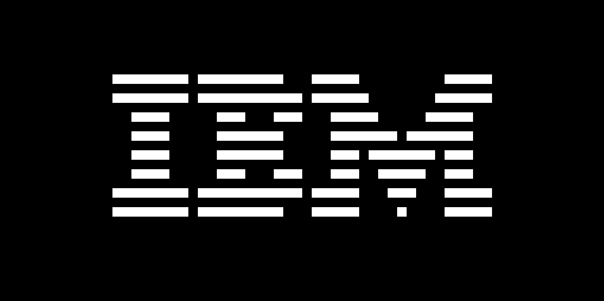
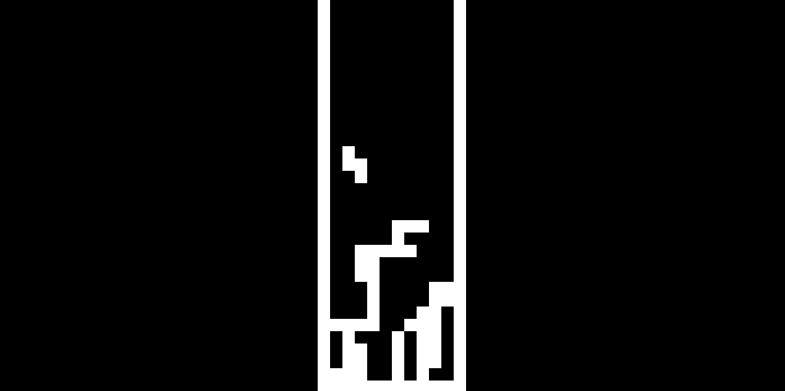
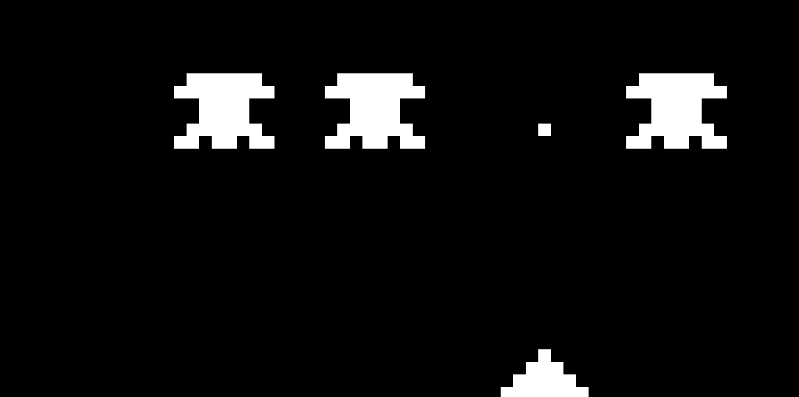
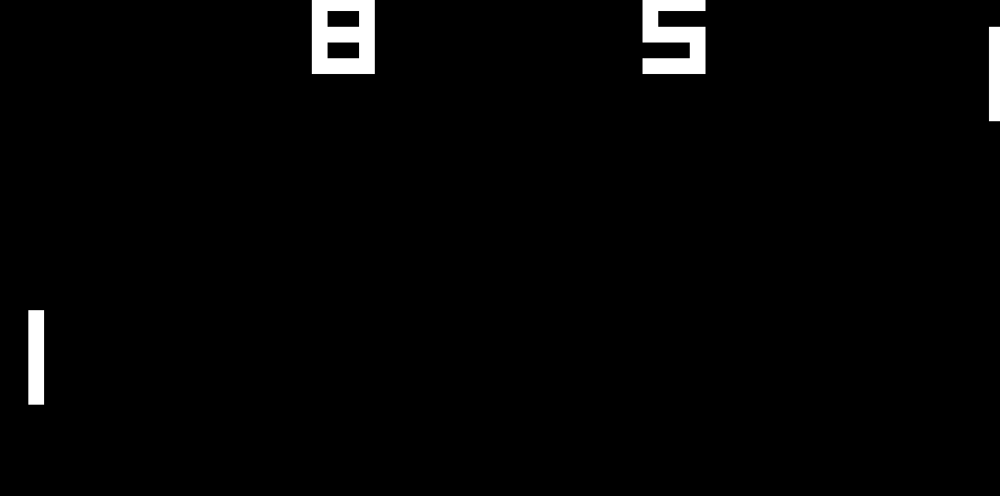

# Chip-8

A Chip-8 emulator written in **Rust** using **SDL2** for graphics (and input).  

 



    

    

    



## Keyboard Mapping
Chip-8 hex keyboard (0x0–0xF) is mapped to your keyboard as follows:

   ```
   1 2 3 C   ->   1 2 3 4
   4 5 6 D   ->   Q W E R
   7 8 9 E   ->   A S D F
   A 0 B F   ->   Z X C V
   ```

## Building and Running

### Prerequisites

1. Install Rust (recommended via [rustup](https://rustup.rs/))
2. Install SDL2 development libraries:

   **Ubuntu / Debian**
   ```bash
   sudo apt update && sudo apt install libsdl2-dev
   ```
   
   **Fedora**
   ```bash
   sudo dnf install SDL2-devel
   ```
   
   **Arch**
   ```bash
   sudo pacman -S sdl2
   ```

   **macOS**
   ```bash
   brew install sdl2
   ```
    
   **Windows**
   ```
   Use vcpkg or download SDL2 from the official site and
   set SDL2_LIB_DIR environment variable.
   ```
### Build & Run
   ```bash
   git clone https://github.com/zaarov/CHIP8VirtualMachine
   cd CHIP8VirtualMachine 
   cargo build --release
   cargo run --release -- path/to/your/rom.ch8
   ```
   
### Nix
The project includes a [flake.nix](./flake.nix) with a full devShell that provides Rust, SDL2, and all required dependencies.
   ```bash
   nix develop
   ```
   ```bash
   cargo build --release
   cargo run --release -- path/to/your/rom.ch8
   ```

## Contributing
* Contributions are welcome! Feel free to open issues or pull requests.
